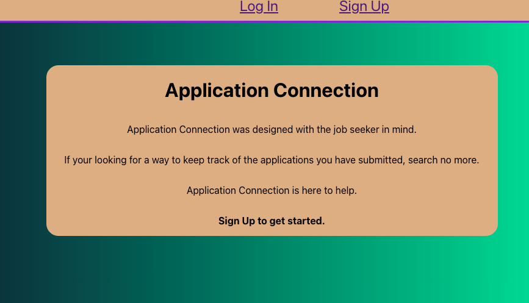
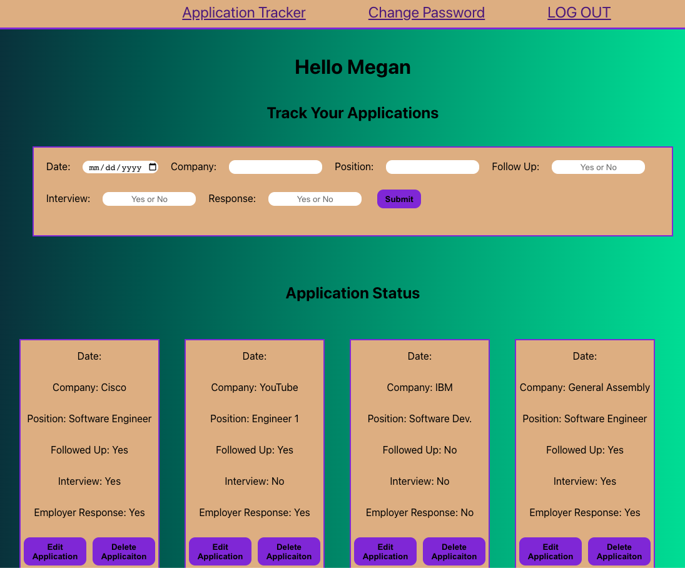

# Application Connection

📌 Application Connection was designed with the job seeker in mind. It offers a simple, fast, and effective way to track applications users have submitted. 

## ➡️ [Try Application Connection](https://application-connection.netlify.app/)

## ➡️ [Check out Application Connection Back End](https://github.com/Megans766/ApplicationConnection-back)

## Technologies Used 💻

## Credits 📫
* Netlify and Fly.io are used for the deployment of this application
* Favicon from faviconer.com
* Markdown badges from GitHub
* Apple Fonts

## Ice Box 🧊
- [] Users can leave notes associated with applications being tracked.
- [] Users can create folders to store/archive applications being tracked.
- [] Users can filter applications being tracked through a seacrh bar.
